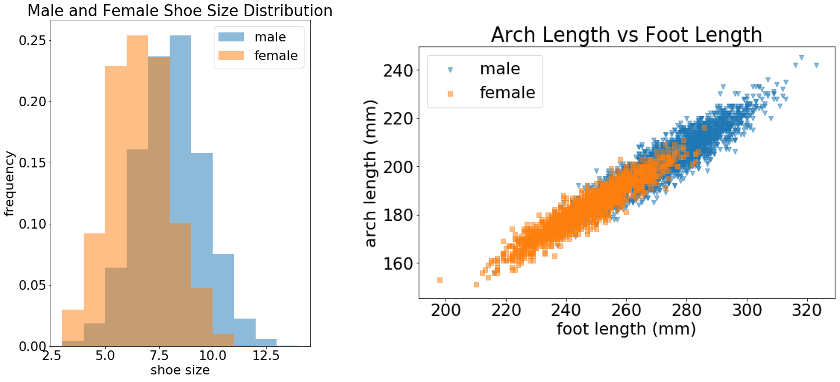
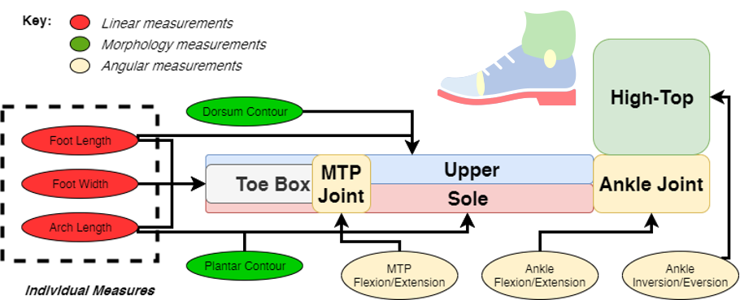
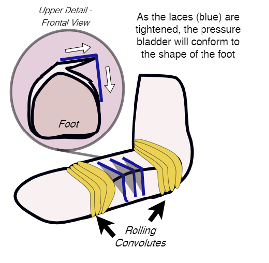
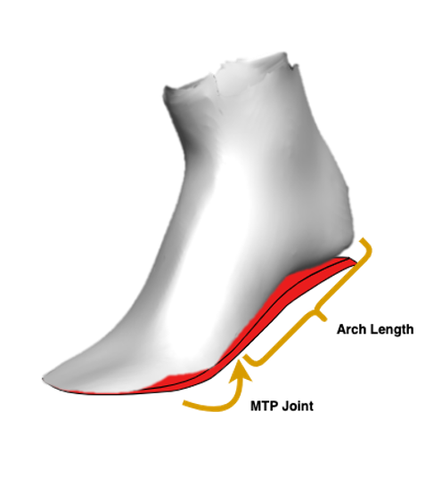

# Specific Aim 3: A design methodology integrating shape modeling into planetary spacesuit boot design

## Introduction

The design for any new spacesuit component should aim to match the required human motions for the intended actions, as well as be sized for the intended population. 
This allows for the component to provide proper fit and mobility to the wearer, but requires a proper understanding of human size and movement to design. 
Combining the dynamic foot morphology model with known foot shape and mobility characteristics provies the necessary information to better fit spacesuit components. 
However, there is not a clear process for integrating all available data to drive spacesuit component design with a focus on improved fit and mobility. 
This object aims to define that process specifically for the spacesuit boot, through the following objectives:

- Literature review of existing foot shape and mobility knowledge
- Development of a biomechanical framework to design a more compatible spacesuit boot
- Design and construction of a spacesuit boot prototype

## Existing Knowledge on Foot Shape Mobility

Specific foot measures which are directly related to fit and mobility need to be identified to feed into the proposed design framework.
Many of these measurements have been characterized through previous analyses28–31. 
The following sections describe each of these specific foot measures and provide their population-derrived nominal values. 
[@fig:SA3-Foot] highlights these foot-specific measures.

{#fig:SA3-Foot}

### Linear Anthropometry

The ANSUR II survey collected a number of foot-related measures which can be analyzed to provide a baseline for foot shapes and sizes[@Gordon2014]. 
Three of these measures are directly related to fit and mobility. 
Foot length and foot width define the outer bounds of the foot shape. 
Foot length and width are directly correlated to US shoe sizes for both width and length. 
Since females generally feature smaller feet than males, female shoe size is typically 1.5 units less than the calculated male size. 
Figure 3a shows that this offset does not sufficiently align the female population to the male population. 
Therefore, it is important to use foot length as a direct measure when fitting or selecting a shoe as opposed to shoe size.

Arch length denotes the location of the metatarsophalangeal (MTP) joints on the foot, one of the important joints during gait. 
Since power is transmitted through the MTP joints, the alignment of the MTP joints with the ball of the shoe is important to ensure power is properly transmitted during heel-off. 
Therefore, the arch length measurement is correlated to standard shoe sizes and if larger, will be selected over the length measurement. 
Figure 3b shows that while arch length is correlated to foot length for both males and females, there is still high variability in this relationship. 
Therefore, arch length is an important measure to consider to ensure proper indexing and dynamic fit between the wearer and spacesuit boot. 

{#fig:SA3-ANSUR}

###  Gait Joint Kinematics

The foot’s main function during gait is to transmit power against the ground, ensuring that the human pushes off and initiates a step. 
During each step, the ankle pushes off from the ground to iniate a step.
Intrinsic foot muscles help stiffen the foot to assist the push-off from the ankle against the ground[@Farris2019]. 
The MTP joint not only exhibits flexion in the saggital plane, but provides the necessary stiffness to allow for the ankle power to translate into push off[@Stefanyshyn1997]. 
Ankle joint rotation may also help balance and stability during gait, particularly on slopes[@Wannop2014]. Neither the ankle joint nor the MTP joint should be restricted in its movement to enable efficient push-off and stability. 
However, free movement of the ankle joint can increase the risk of injury from instability caused by external forces from walking on an uneven surface. 
Therefore, there is a balance to be struck between allowing for movement while preventing potentially injurious movements.  

Nominal values for the foot MTP and ankle joint movement during gait can be derived from the numerous studies conducted on human gait. 
[@Voloshina2013] found that during gait on uneven surfaces, the ankle does not flex past +/- 20 degrees. 
[@Wannop2014] reported  peak foot-floor angles which suggest that on level and sloped surfaces, subjects dorsiflex their ankle up to 40 degrees, and flex their MTP joint up to 60 degrees. 
The MTP joint has been shown to flex between 70-90 degrees during gait[@Mann1979]. 
There is very little ability of the MTP joint to extend or move in the frontal or transverse plane[@Mann1979]; these motions therefore do not have to be limited by an MTP joint on the boot.

The ankle joint exhibits most of its movement in the saggital plane. 
However, the ankle joint can perform inversion/eversion in the frontal plane and internal/external rotation in the transverse plane. 
[@Wannop2014] found that subjects wearing a low-top shoe with no additional ankle stability had up to 10 degrees eversion and 15 degrees inversion while navigating a slope.
However, excessive inversion/eversion may decrease stability and lead to injury. 
During gait, the human normally exerts energy to stabilize their ankle in this direction[@OLoughlin2009]. 
However, any external force can destabilize the ankle, as commonly seen in basketball or hiking[@Bohm2010]. 
Therefore, it will be desired that any boot stabilizes the ankle in this motion. 
In addition, freedom in the transverse plane is desired to allow for positioning of the foot when navigating an uneven surface, aiding in balance[@Wannop2014;@Fraser2016a]. 
[@Wannop2014] found the ankle internally/externally rotates +15/-20 degrees on a slope.

## Biomechanical Boot Design Framework

The proposed design framework will link foot measurements described in the previous section and the dynamic foot shape model to specific footwear design variables, allowing for the design of a spacesuit boot with proper fit and mobility. 
The framework assumes the development of a gas-pressurized spacesuit boot to maintain compatibility with the current xEMU architecture. 
Since gas pressurized spacesuits are stiff when pressurized, they require specially designed joints which allow for flexibility of the stiff structure. 
The gas pressurized layer does not have the ability to stretch once pressurized, and therefore must be sized specifically to fit the population range. 

Footwear design variables are categorized as either population measures or individual measures. 
Population design variables are used in the general design and selections of materials for the shoe, which will accommodate the range of foot shapes and motions seen by the population. 
Individual design variables will be sizing specific elements which are changed between sets of boots to fit inter-individual differences (such as shoe size). 
[@fig:SA3-Overview] shows how each foot measurement is mapped to each footwear design variable. 

{#fig:SA3-Overview}

### Mobility

Footwear is flexible at the MTP and ankle joints to allow for effective push-off during gait. Terrestrial footwear normally derrives flexibility from the materials used for that portion of the shoe; the shoe is typically made of softer materials or less reinforcement at the joints. Since altering materials property stiffness is not an option for spacesuit design, rolling convolute or toroidal joints could be used in the spacesuit footwear to allow for flexibility at the MTP and ankle joints[@Harris2001]. [@fig:SA3-Mobility] shows the desired flexibility based on foot-specific measures. These population measures will ensure that the boot provides enough flexion to not constrict natural motion. 

The MTP joint should target flexion of +90 degrees and the ankle joint should target dorsiflexion/plantarflexion of +40/-20 degrees. 
Due to the potential for unstable terrain, a high top style footwear is suggested to stabilize the ankle, similar to a hiking or military style boot. 
However, it has been shown that a very stiff boot reduces ankle ROM and decreases stability at the knee joint [@Bohm2010], potentially leading to ankle and knee fatigue.
By allowing for a internal/external rotation of +15/-20 degrees, and inversion/eversion of +15/-10 degrees, the boot still allows the foot to navigate a sloped and uneven surface without fatigue.
The relatively low amount of movement will still allow the ankle to be stabilized and lower the risk of injury.

The only requirements previously stated for boot mobility are in the 2019 NASA SBIR Surface Space Suit Boot Solicitation [@NASA2019].
The solicitation matches the +40/-20 degrees ankle dorsiflexion/plantarflexion requirement, but presents no requirements for ankle internal/external rotation, inversion/eversion, or MTP joint flexion. 
The proposed design framework targets higher flexion/extension capability in the ankle joint, as well as specifies extension of the MTP joint, limited ankle internal/external rotation, and limited ankle inversion/eversion.

{#fig:SA3-Mobility}

### Toe box

The toe box accommodates the foot forward of the MTP joint. 
The toes provide the contact for power from the MTP and ankle joints to push off the ground during each step. 
Therefore, the most important feature of the toe box is contact between the toes and the ground during heel-off. 
As a result, the toe box can feature more space around the top of the toes for comfort [@Luximon2009]. 
Since the toe box does not need to provide any additional flexibility, it can be constructed with a less flexible, harder, material to allow for adequate support of the boot and foot. 
In conjunction with the MTP joint, the toe box should also be adjustable such that it can match the arch length of the wearer, allowing for proper fit and indexing of the MTP joint. 

### Upper

The dorsum of the foot is covered by a shoe upper.
The shape of the upper needs to conform to the shape of the dorsum to allow for proper driving of the shoe during any activity [@Feeney2019]. 
Foot shape data taken from a large population will be useful in defining an ideal upper shape that fits a range of persons. 
The boot upper will also have to conform to the foot shape without causing discomfort during movement. 
Dynamic foot shape data can quantify how dorsum shape is changing throughout the gait cycle, allowing for the upper to accommodate any expansion or contraction of the dorsum shape for optimal comfort and support. 
The dynamic foot shape model drive the design of an upper which can be easily scaled to different shoe sizes. 

The upper’s location between the MTP and ankle joint, and its requirement to conform to the shape of the foot, drive the selection of a softer, flexible fabric being used to meet these requirements. 
This presents a challenge with designing the pressure bladder, as the pressure bladder is inherently stiff under pressure. 
Therefore, a soft inner layer above the dorsum may be used which allows the stiff pressurized bladder to conform to the individual’s dorsum. 
Since the dorsum still transmits power to push the shoe off the ground, the soft layer still needs to have enough structure to transmit this power. 
If too soft, the layer will simply act as empty space and the shoe will not respond to ankle flexion during heel-off, potentially resulting in heel-lift. 
Lacing or other closure mechanisms would futher allow the shoe upper to conform to the dorsum and capture the foot. 
Furthermore, the closure mechanism should be customizable by the individual wearing the boot, so each wearer can adjust to where they feel is comfortable. 
Conforming the upper to the dorsum will also minimize contact injuries between the wearer and boot. 

The upper will also play a role in donning and doffing of the spacesuit boot. 
Traditional boots feature laces along the upper which secure the foot inside the boot during activity, but loosen to allow the foot to slip into and out of the boot. 
The closure can be designed in conjunction with a single structured fold in the pressure bladder to allow the pressure bladder to change shape and allow the foot to be released from the boot. 
[@fig:SA3-Upper] shows a possible configuration of the upper using laces which conforms to the shape of the foot while still allowing for donning and doffing.

{#fig:SA3-Upper}

### Sole

The sole in a traditional boot provides traction, support, and protection to the wearer.
The sole needs some thickness to accommodate tread for grip on uneven surfaces. 
In general, the thicker a sole, the stiffer it becomes. 
As a stiff sole resists bending, it might fight against the motion of the foot and shoe during heel-off. 
Therefore, the sole needs to be flexible during heel-off without imparting additional forces on the shoe and upper. 
Dobson et al (2020) found that having a fully flexible sole in coal miner’s boots inhibited the natural roll-off of the foot during gait, resulting in less comfort [@Dobson2020]. 
However, it was not verified if the boot’s flexibility at the MTP joint aligned well with the MTP joint, since sole flexibility was done simply by cutting into the sole near the MTP joints. 
Therefore, it will be imperative to ensure that any flexibility at the MTP joint is either perfectly aligned with the foot, or the flexibility does not inhibit the natural roll off of the foot. 
Dynamic foot shape data can provide a base contour for the sole to be able to bend at the MTP joint during heel-off, as shown in [@fig:SA3-SoleFlex]. 
The sole should have higher flexibility near the MTP joints; doing so will allow the sole curvature to match the foot’s plantar curvature during gait.
In addition, population measures of arch length can help characterize the location of the MTP joint along the foot, ensuring that the MTP joint is properly indexed by the sole. 

{#fig:SA3-SoleFlex}

## Prototyping Construction Plan

### Design Process

The resulting boot design from this framework and corresponding computational analysis will serve as a starting point for iteration of a spacesuit boot prototype.
Due to the difficulty of developing a pressurized boot, an existing boot will first be made pressurized as practice.
Heat-sealable urethane coated nylon (400D, Seattle Fabrics) will be used for the pressure bladder, which was recommended by spacesuit professionals. 
It is expected that a target pressure between 3-5 psi will be reached with this design; for reference, the operating pressure of the EMU spacesuit is 4.3 psi.

A collaboration between CU and the University of Oregon Portland will first create a baseline design around the presented requirements. 
The pressure bladder will be fixed to the inside of the shoe using a series of tabs, ensuring that it is always indexed properly inside the foot.
The rolling convolute and toroidal joints will be designed with well-established methods [@Harris2001]. 
The upper layer will require a specifically designed restraint layer to capture the dynamic motion of the midfoot during gait. 
A collaboration between CU and BOA Technologies will incorporate the use of BOA laces into the restraint layer to capture the midfoot. 
For ease of construction, prototypes will be constructed to one selected test subject's shoe size.
For comparison in Specific Aim 4, a MK III-esque hiking boot will also be constructed with only a constant-volume ankle joint. 

##  Summary

This analysis outlined a framework for designing a new spacesuit boot with an emphasis on fit and mobility during gait. 
The framework aims to reduce the risk of spacesuit boot injury by developing a process to design a spacesuit boot. 
It is expected that focusing a design on fit and mobility will reduce the occurrence of heel-slip and contact injuries. 

This framework therefore serves as bounding requirements to ensure future spacesuit footwear does not inhibit natural foot motion or cause discomfort due to incompatibilities between foot and shoe shape. 
The only previously bounding requirement, the 2019 NASA SBIR solicitation for a new surface space suit boot, had only one requirement for ankle flexion/extension, which was validated in this paper.
There were no requirements other ankle motions or MTP join motions, and no requirement for proper static and dynamic fit to the wearer’s foot.
This work provides a series of requirements based from previous biomechanics studies on foot motion while walking and hiking to provide proper fit and mobility through the spacesuit boot design. 
Prototypes constructed from this work will be validated in Specific Aim 4. 

As of Fall 2020, the literature review and biomechanical design framework have been completed. 
Work is currently starting on the prototype spacesuit boot design and construction. 
The literature review and biomechanical design framework have been presented in a paper published at the 2020 International Conference on Environmental Systems Meeting. 
The final design of the boot will be presented in a future journal paper and conference presentations. 

